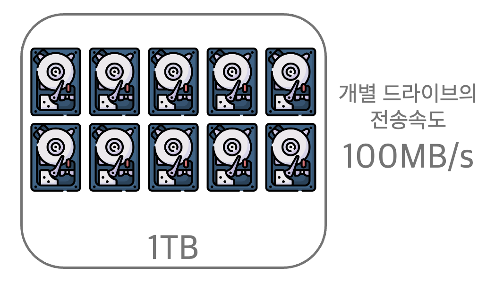

# 하둡 : Hadoop

## 하둡이란?

* 최근 저장 기술의 발전으로 1TB이상의 하드 드라이브가 일반화되고 있습니다. 하지만 전송속도는 아직 100MB/s에 머물러 있기때문에 1TB를 읽는데 **2시간 반 이상**이 소요됩니다.

* 만약 1TB의 데이터를 100개의 하드 드라이브로부터 전송 받는다면 **2분** 안에 읽을 수 있게 됩니다.
  

하지만 이렇게 사용하는 것은 하드 드라이브 용량의 100분의 1만 사용 하는 것으로 낭비라고 느껴질수도 있습니다. 하지만 각 드라이브에게 공유 엑세스를 허락하게 되면 분석 속도가 급격히 빨라질 것이고 또한 병렬처리로 인하여 사용자들의 분석 작업 시간은 고르게 분포될 것입니다.

이렇듯 여러 디스크로부터 데이터를 병렬로 작업하려면 다음의 내용을 검토해야 합니다.

* 하드웨어 장애

  하드웨어가 많아질수록 하드웨어로 인하여 장애가 발생할 가능성도 높아집니다. 하드웨어 장애로 인한 데이터 손실을 막기 위해 대상 데이터를 여러 곳에 복제하여 관리하면 됩니다. 이러한 관리를 위하여 **하둡파일시스템 HDFS**는 조금은 다른 방식이지만 RAID와 같이 작동하게 됩니다.

* 분석 작업을 위한 분할된 데이터의 결합

  다른 분산 시스템의 경우 다중 출처Source를 지원하지만 다중 병합의 정합성1.을 지키기에는 어렵습니다. 하지만 하둡의 맵리듀스mapreduce는 디스크의 읽고 쓰는 문제를 추상화하여 키key와 값value로 계산시킨 프로그래밍 모델을 제공합니다. 맵map과 리듀스reduce계산과정과  병합mixing인터페이스를 제공합니다. 이러한 과정을 통해 안정성reliability를 보장합니다.

> 1) 정합성(Consistency) : 데이터가 서로 모순 없이 일관되게 일치해야 함.

정리하면 **하둡**Hadoop은 **HDFS**를 통해 공유 저장소를 제공하고 **맵리듀스**로 분석을 할수 있게 합니다.

## 하둡과 다른 시스템과의 비교

하둡과 다른 시스템과 다른 시스템에 비해 많은 차이를 보여줍니다.

* RDBMS

  > 관계형 데이터베이스 관리 시스템(Relational DataBase Management System)
  >
  > : 대규모 컴퓨터 시스템을 대상으로 한 많은 이용자가 대량의 데이터를 다룰 때 데이터베이스를 관리하는 시스템. PC용 데이터베이스에 비하여 데이터를 대량으로 취급할 수 있고 신뢰성 측면에서도 뛰어난 업무 시스템을 구축할 수 있음. SQL로 작성된 데이터 조작용 명령에 따라 서버상의 데이터를 조작할 수 있으며, 수정 등의 명령을 서버로 보낼 수 있는 것이면 어떤 클라이언트에서도 서버의 데이터를 조작할 수 있음.

  **"대규모의 일괄 분석을 위하여 다수 디스크와 DB를 함께 사용할 수 없는가?"**

  **"맵리듀스는 왜 필요한가?"**

  하드 디스크 드라이브는 탐색시간seek time이 전송속도transfer rate보다 더 느리게 향상는 특성을 가지고 있습니다. 디스크 드라이브의 탐색은 디스크의 헤드를 디스크의 특정 위치로 이동시키는 과정입니다. 전송속도는 디스크의 대역폭과 관련된다면 탐색시간은 디스크 헤드의 조작 시간과 관련됩니다. 따라서 데이터 엑세스 패턴이 탐색 위주라면, 전송속도에 좌우되는 데이터셋 전체를 스트리밍할때 보다는 데이터셋의 커다란 일부를 읽거나 쓸 때가 더 오래 걸립니다. 대신 DB의 작은 일부를 읽거나 쓸 때는 전통적인 B-트리2.가 더 적합합니다. 하지만 DB의 많은 부분을 업데이트 할때 B-트리는 그 DB를 재구축하기 위해 sort/merge를 사용하기 때문에  맵리듀스가 적합합니다.

  > 2. B-트리 : 관계형 데이터베이스에서 사용되는 구조로, 탐색 속도에 제한적임.

  **여러 방면에서 맵리듀스는 RDBMS를 보완하는 것처럼 보입니다.**

  * RDBMS : 포인트쿼리3.Point Query와 업데이트에 적합한데 상대적으로 작은 양의 데이터를 낮은 지연 시간에 검색하고 업데이트하기 위하여 데이터셋을 색인indexed합니다. 지속적으로 업데이트되는 데이터셋에 적합합니다.
  * 맵리듀스 : 데이터가 한 번 쓰이면 여러 번 읽게 되는 응용프로그램에 적합합니다. 

  |             | RDBMS             | 맵리듀스                 |
  | ----------- | ----------------- | ------------------------ |
  | 데이터 크기 | 기가바이트        | 페타바이트               |
  | 엑세스      | 대화형과 일괄처리 | 일괄처리                 |
  | 업데이트    | 여러 번 읽고 쓰기 | 한 번 쓰면, 여러 번 읽기 |
  | 구조        | 고정 스키마       | 동적 스키마              |
  | 무결성      | 높음              | 낮음                     |
  | 확정성      | 비선혀            | 선형                     |

  

* 그리드 컴퓨팅

* 자발적 컴퓨팅

  