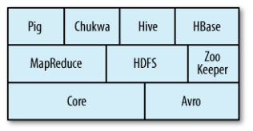

# 하둡 : Hadoop [🔙](../../)

## contents📝

* 1_하둡이란?[👉🏻](#1)
* 2_하둡과 RDBMS와의 비교[👉🏻](#2)
* 3_하둡의 변천사[👉🏻](#3)
* 4_아파치 하둡과 하둡 생태계[👉🏻](#4)

## 1_하둡이란?[📝](#contents)

* 최근 저장 기술의 발전으로 1TB이상의 하드 드라이브가 일반화되고 있습니다. 하지만 전송속도는 아직 100MB/s에 머물러 있기때문에 1TB를 읽는데 **2시간 반 이상**이 소요됩니다.

* 만약 1TB의 데이터를 100개의 하드 드라이브로부터 전송 받는다면 **2분** 안에 읽을 수 있게 됩니다.
  

하지만 이렇게 사용하는 것은 하드 드라이브 용량의 100분의 1만 사용 하는 것으로 낭비라고 느껴질수도 있습니다. 하지만 각 드라이브에게 공유 엑세스를 허락하게 되면 분석 속도가 급격히 빨라질 것이고 또한 병렬처리로 인하여 사용자들의 분석 작업 시간은 고르게 분포될 것입니다.

이렇듯 여러 디스크로부터 데이터를 병렬로 작업하려면 다음의 내용을 검토해야 합니다.

* 하드웨어 장애

  하드웨어가 많아질수록 하드웨어로 인하여 장애가 발생할 가능성도 높아집니다. 하드웨어 장애로 인한 데이터 손실을 막기 위해 대상 데이터를 여러 곳에 복제하여 관리하면 됩니다. 이러한 관리를 위하여 **하둡파일시스템 HDFS**는 조금은 다른 방식이지만 RAID와 같이 작동하게 됩니다.

* 분석 작업을 위한 분할된 데이터의 결합

  다른 분산 시스템의 경우 다중 출처Source를 지원하지만 다중 병합의 정합성1.을 지키기에는 어렵습니다. 하지만 하둡의 맵리듀스mapreduce는 디스크의 읽고 쓰는 문제를 추상화하여 키key와 값value로 계산시킨 프로그래밍 모델을 제공합니다. 맵map과 리듀스reduce계산과정과  병합mixing인터페이스를 제공합니다. 이러한 과정을 통해 안정성reliability를 보장합니다.

> 1) 정합성(Consistency) : 데이터가 서로 모순 없이 일관되게 일치해야 함.

정리하면 **하둡**Hadoop은 **HDFS**를 통해 공유 저장소를 제공하고 **맵리듀스**로 분석을 할수 있게 합니다.

## 2_하둡과 RDBMS와의 비교[📝](#contents)

* RDBMS

  > 관계형 데이터베이스 관리 시스템(Relational DataBase Management System)
  >
  > : 대규모 컴퓨터 시스템을 대상으로 한 많은 이용자가 대량의 데이터를 다룰 때 데이터베이스를 관리하는 시스템. PC용 데이터베이스에 비하여 데이터를 대량으로 취급할 수 있고 신뢰성 측면에서도 뛰어난 업무 시스템을 구축할 수 있음. SQL로 작성된 데이터 조작용 명령에 따라 서버상의 데이터를 조작할 수 있으며, 수정 등의 명령을 서버로 보낼 수 있는 것이면 어떤 클라이언트에서도 서버의 데이터를 조작할 수 있음.

  **"대규모의 일괄 분석을 위하여 다수 디스크와 DB를 함께 사용할 수 없는가?"**

  **"맵리듀스는 왜 필요한가?"**

  하드 디스크 드라이브는 탐색시간seek time이 전송속도transfer rate보다 더 느리게 향상는 특성을 가지고 있습니다. 디스크 드라이브의 탐색은 디스크의 헤드를 디스크의 특정 위치로 이동시키는 과정입니다. 전송속도는 디스크의 대역폭과 관련된다면 탐색시간은 디스크 헤드의 조작 시간과 관련됩니다. 따라서 데이터 엑세스 패턴이 탐색 위주라면, 전송속도에 좌우되는 데이터셋 전체를 스트리밍할때 보다는 데이터셋의 커다란 일부를 읽거나 쓸 때가 더 오래 걸립니다. 대신 DB의 작은 일부를 읽거나 쓸 때는 전통적인 B-트리2.가 더 적합합니다. 하지만 DB의 많은 부분을 업데이트 할때 B-트리는 그 DB를 재구축하기 위해 sort/merge를 사용하기 때문에  맵리듀스가 적합합니다.

  > 2. B-트리 : 관계형 데이터베이스에서 사용되는 구조로, 탐색 속도에 제한적임.

  **여러 방면에서 맵리듀스는 RDBMS를 보완하는 것처럼 보입니다.**

  * RDBMS : 포인트쿼리3.Point Query와 업데이트에 적합한데 상대적으로 작은 양의 데이터를 낮은 지연 시간에 검색하고 업데이트하기 위하여 데이터셋을 색인indexed합니다. 지속적으로 업데이트되는 데이터셋에 적합합니다.
  * 맵리듀스 : 데이터가 한 번 쓰이면 여러 번 읽게 되는 응용프로그램에 적합합니다. 

  |             | RDBMS             | 맵리듀스                 |
  | ----------- | ----------------- | ------------------------ |
  | 데이터 크기 | 기가바이트        | 페타바이트               |
  | 엑세스      | 대화형과 일괄처리 | 일괄처리                 |
  | 업데이트    | 여러 번 읽고 쓰기 | 한 번 쓰면, 여러 번 읽기 |
  | 구조        | 고정 스키마       | 동적 스키마              |
  | 무결성      | 높음              | 낮음                     |
  | 확정성      | 비선형            | 선형                     |

  **구조화된 데이터, 반구조화된 데이터, 비구조화된 데이터**

  * 구조화된 데이터(structured data) : XML문서나 미리 정해진 스키마에 부합하는 DB테이블과 같이 정해진 형태가 있는 엔티티들로 구성됩니다.
  * 반구조화된 데이터(semi-structured data) : 구조화된 데이터에 비해서 조금 더 자유롭고, 스키마가 있다 해도 종종 무시되기 때문에 데이터 구조에 대한 참조 정도로 사용됩니다. 스프레드시트와 같이 그리드 형태로 되어 있지만 각 셀에 데이터라도 넣을 수 있도록 되어 있습니다.
  * 비구조화된 데이터(unstructured data) : 어떠한 특별한 내부 구조도 없습니다. 일반 텍스트, 이미지 데이터 등이 이러한 데이터에 속합니다.

   하지만, 맵리듀스는 RDBMS에서 중요하게 여기는 무결성 유지와 중복 제거를 위한 정규화normalized를 문제점으로 거론이됩니다. 레코드 읽기를 비지역non-local 연산으로 만들고, (고속의)스트리밍 읽기와 쓰기가 가능하다는 것을 맵리듀스는 주요한 전제사항으로 하기 때문입니다. 웹 서비스에서 발생하는 로그에서 호스트네임은 같은 클라이언트가 여러 번 나타날지라도 매번 완전하게 표현됩니다. 이 점은 맵리듀스를 통해 모든 종류의 로그 파일 분석이 용이하게 만듭니다.

  시간이 지날수록 RDBMS들이 맵리듀스로부터 일부 아이디어들(Aster Data, Greenplum 등)을 수용하고 있고 맵리듀스에 추가된 고수준의 쿼리 언어(Pig나 Hive 등)들 덕분에 맵리듀스 시스템은 전통적인 DB프로그래머들에게 더욱 친근해지고 있습니다.

## 3_하둡의 변천사[📝](#contents)

 하둡은 오픈소스 웹 검색엔진인 아파치 너치apache nutch에서 루씬 프로젝트의 일부로 탄생하게 되었습니다. 이 프로젝트는 밑바닥부터 웹 검색엔진을 개발하는 목표로 시작되어 웹사이트를 크롤crawl하고 색인하는 소프트웨어를 만들고 다수의 서버와 대용량의 데이터를 전문적인 운영팀의 도움없이 진행되는 프로젝트입니다. 10억 페이지 색인을 위한 시스템을 유지하기 위해서 하드웨어에만 매달 3만 달러의 운영비와 약 50만 달러의 비용이 드는 것으로 평가되었습니다. 비용이 상당하지만 이러한 웹 검색 엔진이 오픈되고 검색엔진 알고리즘이 대중화되는 기대 속에서 프로젝트를 이어갔습니다.

 2002년  시작된 너치nutch로 인해 크롤러와 검색 엔진을 빠르게 출현 시켰지만 수십억 되는 웹페이로의 확장은 불가능했습니다. 2003년 구글에서 활용하던 GFSGoogle File System은 웹 크롤과 색인 과정에서 필요한 스토리지 충족시켰습니다. 분산시스템은 스토리지 노드 관리와 같은 부가작업에 시간을 허비할 필요가 없었습니다. 이는 NDFSNutch Distributed File System이라는 오픈소스를 구현하기로 했습니다.

2004년 구글은 맵리듀스를 소개하는 논문을 발표하였고 2005년 너치 개발자들은 너치에 맵리듀스를 구현하고 NDFS와 맵리듀스를 사용하기 시작했습니다. 이후 2006년 루씬 프로젝트에서 나와 독립 프로젝트로 하둡을 개발하게 되었고 야후에서 하둡의 웹 규모로의 전환하는 프로젝트를 진행하여습니다. 2008년 2월에 이것이 시연되어 야후는 10,000 코어 하둡 클러스터에서 그들의 검색 색인 제품이 시연되고 있다고 공표하였습니다. 이후 다양한 분야에서 하둡이 활용되고 있습니다.

## 4_아파치 하둡과 하둡 생태계[📝](#contents)

| 기술 스택                    | 설명                                                         |
| ---------------------------- | ------------------------------------------------------------ |
| 공통                         | 분산 파일시스템과 일반적인 I/O(직렬화, 자바 RPC, 영속persistent데이터 구조)를 위한 컴포넌트와 인터페이스 집합 |
| 에이브로Avro      | 교차언어cross-language RPC와 영속적인 데이터 스토리지를 위한 데이터 직렬화 시스템 |
| 맵리듀스mapreduce | 범용 컴퓨터들의 커다란 클러스터에서 수행되는 분산 데이터 처리 모델과 실행 환경 |
| HDFS                         | 범용 컴퓨터들로 된 커다란 클러스터에서 수행되는 분산 파일시스템 |
| 피그Pig           | 대구모 데이터셋 탐색용 데이터 흐름 언어data flow language와 실행 환경. HDFS와 맵리듀스 클러스터에서 수행된다. |
| 하이브Hive        | 분산 데이터웨어하우스DataWarehous, HDFS에 저장된 데이터를 관리하고, 데이터 쿼리를 위하여 SQL 기반 쿼리 언어(런타임 엔진에 의해 맵리듀스로 변환되는)를 제공한다. |
| HBase                        | 분산 컬럼 지향Column-Oriented데이터베이스 스토리지로 HDFS를 사용한다. 맵리듀스를 이용한 일괄처리 방식의 계산과 랜덤 읽기가 가능한 포인트 쿼리 방식 모두를 지원한다. |
| 주키퍼Zookeeper   | 다수 컴퓨터로 분산 처리되는 고가용성 조정Highly Available Coordination서비스 분산 응용프로그램들을 구축하기 위하여 사용될 수 있는 분산 락Distributed-Lock같은 프리머티브Primitive를 제공한다. |
| 스툽Sqoop         | 관계형 데이터베이스와 HDFS 간 데이터를 효율적으로 이동시키기 위한 도구 |