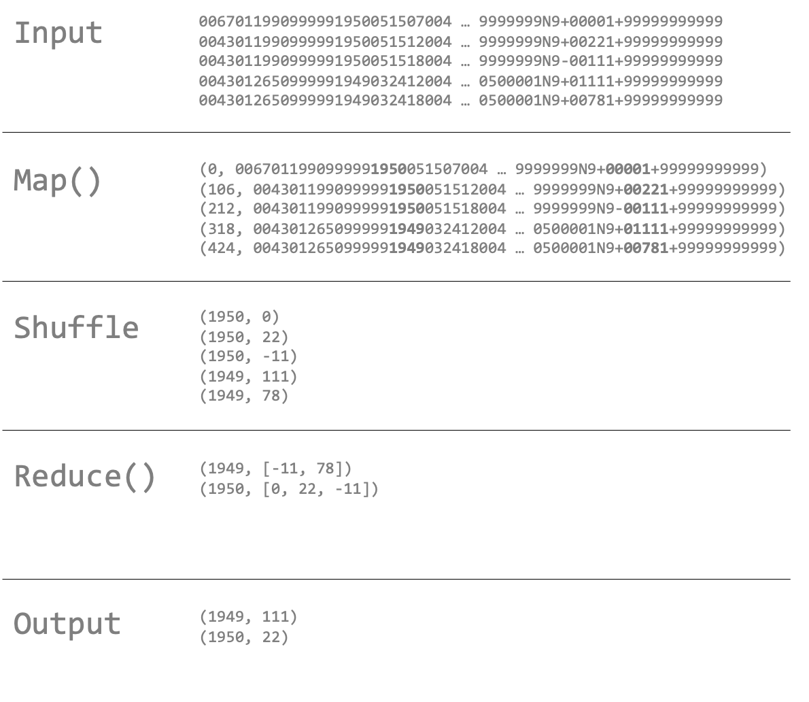

# 맵리듀스 : MapReduce [🔙](../../)

## contents📝

* 1_맵과 리듀스[👉🏻](#1)
* 2_맵리듀스의 분산형으로의 확장[👉🏻](#2)

## 1_맵과 리듀스[📝](#contents)

 맵리듀스는 맵 단계와 리듀스 단계로 처리 과정을 나누어 작업합니다. 각 단계에는 입력과 출력으로 키-값 쌍을 가지고 있고 이러한 과정은 프로그래머가 직접 함수로 작성합니다.

* 맵Map

  맵 함수는 입력 데이터를 가지고 키-값의 쌍을 생성합니다. 맵 함수는 단순히 필요한 데이터를 추출하고 내보냅니다. 이렇게 출력된 값은 리듀스 함수로 보내지기 전에 키를 중심으로 정렬을 진행하고 그룹을 만듭니다. 

* 리듀스Reduce

  앞서 맵의 과정에서 입력되었던 리스트 형태의 데이터를 바탕으로 리스트에서 원하는 값을 출력하게 됩니다. 

다음은 NCDC 데이터셋을 통해 매년 기록된 최고 지구 기온에 대한 맵리듀스 과정을 나타낸 그림입니다.

## 2_맵리듀스의 분산형으로의 확장[📝](#contents)

 앞의 설명은 데이터의 입력 값이 작을 때를 예를 들어 이야기했습니다. 이번에는 시스템에서 입력이 클 때 어떻게 데이터를 처리하는지 살펴보려 합니다.